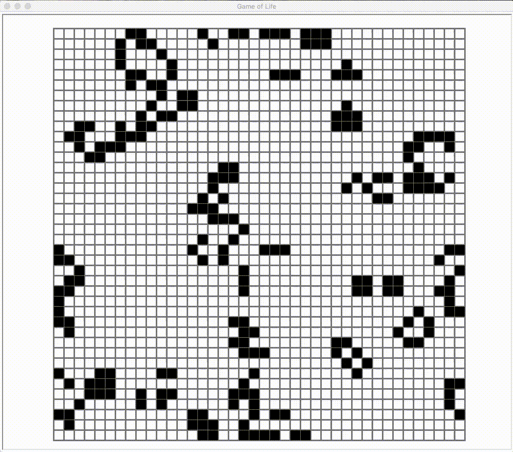

# Conway's Game of Life

Conway's Game of Life implemented using Python 3 and turtle module.

Conways’s Game Of Life is a Cellular Automation Method created by John Conway. This game was created with Biology in mind but has been applied in various fields such as Graphics, terrain generation,etc..
The “game” is a zero-player game, meaning that its evolution is determined by its initial state, requiring no further input. One interacts with the Game of Life by creating an initial configuration and observing how it evolves, or, for advanced “players”, by creating patterns with particular properties.

### Rules
   1. Any live cell with fewer than two live neighbours dies, as if by underpopulation.
   2. Any live cell with two or three live neighbours lives on to the next generation.
   3. Any live cell with more than three live neighbours dies, as if by overpopulation.
   4. Any dead cell with exactly three live neighbours becomes a live cell, as if by reproduction. 





### Usage

1. To use as a module import the life_module file.
    ```
    import life_module
    life_object = life_module.gol()
    life_object.game(refresh_rate=200,board_size=40)
    ```
    ```
    Optional parameters

    1. refresh_rate - Defines the update interval of grid or refresh rate in milliseconds.
    2. board_size - Defines the number of cells horizontally and vertically in matrix board. 
    ```
2. To run in Terminal navigate to the directory containing life.py file and type the follwing command.
    ```
    python3 life.py --refresh_rate 200 --board_size 40
    ```
    ```
    Optional parameters
  
    1. --refresh_rate - Defines the update interval of grid or refresh rate in milliseconds.
    2. --board_size - Defines the number of cells horizontally and vertically in matrix board.
    ```
